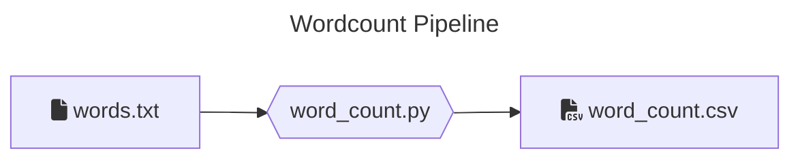

# Data transformations with Python

This coding challenge is a collection of _Python_ jobs that are supposed to extract, transform and load data.
These jobs are using _PySpark_ to process larger volumes of data and are supposed to run on a _Spark_ cluster (via `spark-submit`).

### Local Setup

> 💡 If you don't manage to run the local setup or you have restrictions to install software in your laptop, use the [gitpod](#gitpod-setup) one

#### Pre-requisites

Please make sure you have the following installed and can run them

- Python (3.11.X), you can use for example [pyenv](https://github.com/pyenv/pyenv#installation) to manage your python versions locally
- [Poetry](https://python-poetry.org/docs/#installation)
- Java (11), you can use [sdkman](https://sdkman.io/) to install and manage java locally

#### Windows users

We recommend using WSL 2 on Windows for this exercise, due to the [lack of support](https://cwiki.apache.org/confluence/display/HADOOP2/WindowsProblems) of windows paths from Hadoop/Spark.

Follow instructions on the [Windows official page](https://learn.microsoft.com/en-us/windows/wsl/setup/environment)

> 💡 In case of issues, like missing permissions on the machine, please use the [gitpod setup](#gitpod-setup)

#### Install all dependencies

```bash
poetry install
```

### Gitpod setup

Alternatively, you can setup the environment using

[](https://gitpod.io/#https://github.com/techops-recsys-lateral-hiring/dataengineer-transformations-python)

There's an initialize script setup that takes around 3 minutes to complete. Once you use paste this repository link in new Workspace, please wait until the packages are installed. After everything is setup, select Poetry's environment by clicking on thumbs up icon and navigate to Testing tab and hit refresh icon to discover tests.

Note that you can use gitpod's web interface or setup [ssh to Gitpod](https://www.gitpod.io/docs/references/ides-and-editors/vscode#connecting-to-vs-code-desktop) so that you can use VS Code from local to remote to Gitpod

Remember to stop the vm and restart it just before the interview.

### Verify setup

> All of the following commands should be running successfully

#### Run unit tests

```bash
poetry run pytest tests/unit
```

#### Run integration tests

```bash
poetry run pytest tests/integration
```

#### Run style checks

```bash
poetry run mypy --ignore-missing-imports --disallow-untyped-calls --disallow-untyped-defs --disallow-incomplete-defs \
            data_transformations tests

poetry run pylint data_transformations tests
```

### Anything else?

All commands are passing?  
You are good to go!

You are allowed to customize your environment (having the test in vscode directly for example): feel free to spend the time making this comfortable for you. This is not an expectation.

## Jobs

This repo contains a "Word count" exercise.

Currently, it exists as a skeleton, and it has some **initial test cases** which are defined but some are skipped.

The following section provides context over them.

### Code walk

```

/
├─ /data_transformations # Contains the main python library
│ # with the code to the transformations
│
├─ /jobs # Contains the entry points to the jobs
│ # performs argument parsing, and are
│ # passed to `spark-submit`
│
├─ /resources # Contains the raw datasets for the jobs
│
├─ /tests
│ ├─ /units # contains basic unit tests for the code
│ └─ /integration # contains integrations tests for the jobs
│ # and the setup
│
├─ .gitignore
├─ .gitpod\* # required for the gitpod setup
├─ .pylintrc # configuration for pylint
├─ LICENCE
├─ poetry.lock
├─ pyproject.toml
└─ README.md # The current file

```

### Word Count

A NLP model is dependent on a specific input file. This job is supposed to preprocess a given text file to produce this
input file for the NLP model (feature engineering). This job will count the occurrences of a word within the given text
file (corpus).

There is a dump of the datalake for this under `resources/word_count/words.txt` with a text file.



#### Input

Simple `*.txt` file containing text.

#### Output

A single `*.csv` file containing data similar to:

```csv
"word","count"
"a","3"
"an","5"
...
```

#### Run the job

```bash
poetry build && poetry run spark-submit \
    --master local \
    --py-files dist/data_transformations-*.whl \
    jobs/word_count.py \
    <INPUT_FILE_PATH> \
    <OUTPUT_PATH>
```

## Reading List

If you are unfamiliar with some of the tools used here, we recommend some resources to get started

- **pytest**: [official](https://docs.pytest.org/en/8.2.x/getting-started.html#get-started)
- **pyspark**: [official](https://spark.apache.org/docs/latest/api/python/index.html) and especially the [DataFrame quickstart](https://spark.apache.org/docs/latest/api/python/getting_started/quickstart_df.html)
